# DC1 — Topology Diagram

## Physical & Logical Structure

```mermaid
graph TB
    subgraph INTERNET["Internet / WAN"]
        FR2["FR2-EDGE-01/02<br/>Equinix FR2"]
        FR6["FR6-EDGE-01/02<br/>Equinix FR6"]
    end

    subgraph EQX_DC1["Equinix DC1 (Cross-connect)"]
        PATCH["EQX-DC1-PATCH-01<br/>Port1 · Port2"]
    end

    subgraph DC1_FABRIC["DC1 Fabric"]
        SS1["DC1-SS1<br/>Super-Spine 1<br/>Eth1/1-4 → spines<br/>Eth1/5-6 → Equinix"]
        SS2["DC1-SS2<br/>Super-Spine 2<br/>Eth1/1-4 → spines"]

        subgraph POD1["POD1 — Customer 1"]
            SP1["DC1-POD1-SP1<br/>Spine 1"]
            SP2["DC1-POD1-SP2<br/>Spine 2"]
            L1["DC1-POD1-L1<br/>Leaf 1<br/>Eth1/52→CUST1-FW-01<br/>Eth1/53→CUST1-FW-02"]
            L2["DC1-POD1-L2<br/>Leaf 2<br/>Eth1/52→CUST1-FW-01<br/>Eth1/53→CUST1-FW-02"]
            L3["DC1-POD1-L3<br/>Leaf 3"]
            L4["DC1-POD1-L4<br/>Leaf 4"]
            SRV01["DC1-POD1-SRV-01<br/>Server · bond0"]
            SRV02["DC1-POD1-SRV-02<br/>Server · bond0"]
            SRVASS["DC1-POD1-SRV-ASS-01<br/>Server · bond0"]

            subgraph FW1_PAIR["CUST1 FW Pair (active-passive PBR)"]
                FW1A["DC1-CUST1-FW-01<br/>SRX-1500 · ACTIVE<br/>ge-0/0/0 inside→L1<br/>ge-0/0/1 outside→L2<br/>ge-0/0/2 HA sync"]
                FW1B["DC1-CUST1-FW-02<br/>SRX-1500 · PASSIVE<br/>ge-0/0/0 inside→L1<br/>ge-0/0/1 outside→L2<br/>ge-0/0/2 HA sync"]
            end
        end

        subgraph POD2["POD2 — Customer 2"]
            SP3["DC1-POD2-SP1<br/>Spine 1"]
            SP4["DC1-POD2-SP2<br/>Spine 2"]
            L5["DC1-POD2-L1<br/>Leaf 1<br/>Eth1/52→CUST2-FW-01<br/>Eth1/53→CUST2-FW-02"]
            L6["DC1-POD2-L2<br/>Leaf 2<br/>Eth1/52→CUST2-FW-01<br/>Eth1/53→CUST2-FW-02"]
            L7["DC1-POD2-L3<br/>Leaf 3"]
            L8["DC1-POD2-L4<br/>Leaf 4"]
            SRV03["DC1-POD2-SRV-01<br/>Server · bond0"]
            SRV04["DC1-POD2-SRV-02<br/>Server · bond0"]

            subgraph FW2_PAIR["CUST2 FW Pair (active-passive PBR)"]
                FW2A["DC1-CUST2-FW-01<br/>SRX-1500 · ACTIVE<br/>ge-0/0/0 inside→L1<br/>ge-0/0/1 outside→L2<br/>ge-0/0/2 HA sync"]
                FW2B["DC1-CUST2-FW-02<br/>SRX-1500 · PASSIVE<br/>ge-0/0/0 inside→L1<br/>ge-0/0/1 outside→L2<br/>ge-0/0/2 HA sync"]
            end
        end
    end

    subgraph SEGMENTS["Segments (VXLAN)"]
        S1["customer-1-web-frontend-production<br/>CUST001-PROD · pbr→CUST1-FW-01"]
        S2["customer-1-app-backend-production<br/>CUST001-PROD · pbr→CUST1-FW-01"]
        S3["customer-1-database-production<br/>CUST001-PROD · pbr→CUST1-FW-01"]
        S4["customer-2-web-frontend-production<br/>CUST002-PROD · pbr→CUST2-FW-01"]
        S5["customer-2-app-backend-production<br/>CUST002-PROD · pbr→CUST2-FW-01"]
    end

    %% Equinix uplinks (SS1 only)
    SS1 -->|"Eth1/5 → Port1"| PATCH
    SS1 -->|"Eth1/6 → Port2"| PATCH
    PATCH -->|"PHYS-DC1-FR2-EQX-01"| FR2
    PATCH -->|"PHYS-DC1-FR6-EQX-01"| FR6

    %% POD1 spine → super-spine
    SP1 -->|"Eth1/1"| SS1
    SP1 -->|"Eth1/2"| SS2
    SP2 -->|"Eth1/1"| SS1
    SP2 -->|"Eth1/2"| SS2

    %% POD2 spine → super-spine
    SP3 -->|"Eth1/1"| SS1
    SP3 -->|"Eth1/2"| SS2
    SP4 -->|"Eth1/1"| SS1
    SP4 -->|"Eth1/2"| SS2

    %% POD1 leaf → spine
    L1 -->|"Eth1/1"| SP1
    L1 -->|"Eth1/2"| SP2
    L2 -->|"Eth1/1"| SP1
    L2 -->|"Eth1/2"| SP2
    L3 -->|"Eth1/1"| SP1
    L3 -->|"Eth1/2"| SP2
    L4 -->|"Eth1/1"| SP1
    L4 -->|"Eth1/2"| SP2

    %% POD2 leaf → spine
    L5 -->|"Eth1/1"| SP3
    L5 -->|"Eth1/2"| SP4
    L6 -->|"Eth1/1"| SP3
    L6 -->|"Eth1/2"| SP4
    L7 -->|"Eth1/1"| SP3
    L7 -->|"Eth1/2"| SP4
    L8 -->|"Eth1/1"| SP3
    L8 -->|"Eth1/2"| SP4

    %% POD1 servers → leaves (MLAG)
    SRV01 -->|"eno1"| L1
    SRV01 -->|"eno2"| L2
    SRV02 -->|"eno1"| L1
    SRV02 -->|"eno2"| L2
    SRVASS -->|"eno1"| L1
    SRVASS -->|"eno2"| L2

    %% POD2 servers → leaves (MLAG)
    SRV03 -->|"eno1"| L5
    SRV03 -->|"eno2"| L6
    SRV04 -->|"eno1"| L5
    SRV04 -->|"eno2"| L6

    %% CUST1 FW pair ↔ leaves (PBR path)
    FW1A -->|"ge-0/0/0 inside"| L1
    FW1A -->|"ge-0/0/1 outside"| L2
    FW1B -->|"ge-0/0/0 inside"| L1
    FW1B -->|"ge-0/0/1 outside"| L2
    FW1A <-->|"ge-0/0/2 HA sync"| FW1B

    %% CUST2 FW pair ↔ leaves (PBR path)
    FW2A -->|"ge-0/0/0 inside"| L5
    FW2A -->|"ge-0/0/1 outside"| L6
    FW2B -->|"ge-0/0/0 inside"| L5
    FW2B -->|"ge-0/0/1 outside"| L6
    FW2A <-->|"ge-0/0/2 HA sync"| FW2B

    %% PBR segment associations (logical)
    FW1A -. "protects (active)" .-> S1
    FW1A -. "protects (active)" .-> S2
    FW1A -. "protects (active)" .-> S3
    FW2A -. "protects (active)" .-> S4
    FW2A -. "protects (active)" .-> S5

    %% Styling
    style FW1A fill:#6e5abd,color:#fff
    style FW1B fill:#9b8fd4,color:#fff
    style FW2A fill:#6e5abd,color:#fff
    style FW2B fill:#9b8fd4,color:#fff
    style SS1 fill:#aeeeee
    style SS2 fill:#aeeeee
    style SP1 fill:#e6e6fa
    style SP2 fill:#e6e6fa
    style SP3 fill:#e6e6fa
    style SP4 fill:#e6e6fa
    style PATCH fill:#d4b8a0
```

## Security Model

| Device | Type | Model | Role | Placement |
| --- | --- | --- | --- | --- |
| `DC1-CUST1-FW-01` | Physical | SRX-1500 | Active | POD1, rack dc1-s1-r-1 |
| `DC1-CUST1-FW-02` | Physical | SRX-1500 | Passive | POD1, rack dc1-s1-r-1 |
| `DC1-CUST2-FW-01` | Physical | SRX-1500 | Active | POD2, rack dc1-s1-r-2 |
| `DC1-CUST2-FW-02` | Physical | SRX-1500 | Passive | POD2, rack dc1-s1-r-2 |

**Firewall model: PBR active-passive**
Leaf L1 redirects customer VRF traffic via PBR to the active FW's inside port (`ge-0/0/0`). Inspected traffic returns via the outside port (`ge-0/0/1`) to leaf L2. The passive FW is pre-cabled and synchronises session state over the back-to-back HA link (`ge-0/0/2 ↔ ge-0/0/2`). On failure the passive promotes to active with no re-cabling needed.

| Segment | Namespace | Active FW | PBR |
| --- | --- | --- | --- |
| `customer-1-web-frontend-production` | CUST001-PROD | DC1-CUST1-FW-01 | ✓ |
| `customer-1-app-backend-production` | CUST001-PROD | DC1-CUST1-FW-01 | ✓ |
| `customer-1-database-production` | CUST001-PROD | DC1-CUST1-FW-01 | ✓ |
| `customer-2-web-frontend-production` | CUST002-PROD | DC1-CUST2-FW-01 | ✓ |
| `customer-2-app-backend-production` | CUST002-PROD | DC1-CUST2-FW-01 | ✓ |

## Policies

| Policy | Devices | Default | Rules |
| --- | --- | --- | --- |
| `DC1-CUST1-EAST-WEST-POLICY` | CUST1-FW-01, CUST1-FW-02 | deny | web→app (80/443), app→db (5432) |
| `DC1-CUST2-EAST-WEST-POLICY` | CUST2-FW-01, CUST2-FW-02 | deny | web→app (443) |
