# DC2 — Topology Diagram

## Physical & Logical Structure

```mermaid
graph TB
    subgraph INTERNET["Internet / WAN"]
        PA4["PA4-EDGE-01/02<br/>Equinix PA4"]
        PA6["PA6-EDGE-01/02<br/>Equinix PA6"]
    end

    subgraph EQX_DC2["Equinix DC2 (Cross-connect)"]
        PATCH["EQX-DC2-PATCH-01<br/>Port1 · Port2"]
    end

    subgraph DC2_FABRIC["DC2 Fabric"]
        SS1["DC2-SS1<br/>Super-Spine 1<br/>Eth1/1 → FW-01 outside<br/>Eth1/5-6 → Equinix"]
        SS2["DC2-SS2<br/>Super-Spine 2<br/>Eth1/1 → FW-02 outside"]

        subgraph FW_TIER["Firewall Tier (active-active)"]
            FW1["DC2-FW-01<br/>SRX-1500 · role: firewall<br/>ge-0/0/0-3 inside (1 port/spine)<br/>ge-0/0/4 outside (SS1)<br/>ge-0/0/5 HA sync"]
            FW2["DC2-FW-02<br/>SRX-1500 · role: firewall<br/>ge-0/0/0-3 inside (1 port/spine)<br/>ge-0/0/4 outside (SS2)<br/>ge-0/0/5 HA sync"]
        end

        subgraph POD1["POD1"]
            SP1["DC2-POD1-SP1<br/>Spine 1"]
            SP2["DC2-POD1-SP2<br/>Spine 2"]
            L1["DC2-POD1-L1<br/>Leaf 1"]
            L2["DC2-POD1-L2<br/>Leaf 2"]
            L3["DC2-POD1-L3<br/>Leaf 3"]
            L4["DC2-POD1-L4<br/>Leaf 4"]
            SRV01["DC2-POD1-SRV-01<br/>Server · bond0"]
            SRV02["DC2-POD1-SRV-02<br/>Server · bond0"]
        end

        subgraph POD2["POD2"]
            SP3["DC2-POD2-SP1<br/>Spine 1"]
            SP4["DC2-POD2-SP2<br/>Spine 2"]
            L5["DC2-POD2-L1<br/>Leaf 1"]
            L6["DC2-POD2-L2<br/>Leaf 2"]
            L7["DC2-POD2-L3<br/>Leaf 3"]
            L8["DC2-POD2-L4<br/>Leaf 4"]
            SRV03["DC2-POD2-SRV-01<br/>Server · bond0"]
            SRV04["DC2-POD2-SRV-02<br/>Server · bond0"]
        end
    end

    subgraph SEGMENTS["Segments (VXLAN)"]
        S1["customer-1-web-frontend-production<br/>CUST001-PROD · inline→ FW-01"]
        S2["customer-1-app-backend-production<br/>CUST001-PROD · inline→ FW-01"]
        S3["customer-2-web-frontend-production<br/>CUST002-PROD · inline→ FW-02"]
        S4["customer-2-app-backend-production<br/>CUST002-PROD · inline→ FW-02"]
    end

    %% Equinix uplinks (SS1 only)
    SS1 -->|"Eth1/5 → Port1<br/>CBL-DC2-SS1-EQX-DC2-PATCH-P1"| PATCH
    SS1 -->|"Eth1/6 → Port2<br/>CBL-DC2-SS1-EQX-DC2-PATCH-P2"| PATCH
    PATCH -->|"PHYS-DC2-PA4-EQX-01"| PA4
    PATCH -->|"PHYS-DC2-PA6-EQX-01"| PA6

    %% FW outside → super-spines
    FW1 -->|"ge-0/0/1 → Eth1/1<br/>CBL-DC2-FW01-SS1-OUTSIDE"| SS1
    FW2 -->|"ge-0/0/1 → Eth1/1<br/>CBL-DC2-FW02-SS2-OUTSIDE"| SS2

    %% HA sync back-to-back
    FW1 <-->|"ge-0/0/2 ↔ ge-0/0/2<br/>CBL-DC2-FW01-FW02-HA-SYNC"| FW2

    %% POD1 spines → FW pair (Eth1/1 → FW-01, Eth1/2 → FW-02)
    SP1 -->|"Eth1/1 → ge-0/0/0"| FW1
    SP1 -->|"Eth1/2 → ge-0/0/0"| FW2
    SP2 -->|"Eth1/1 → ge-0/0/3"| FW1
    SP2 -->|"Eth1/2 → ge-0/0/3"| FW2

    %% POD2 spines → FW pair
    SP3 -->|"Eth1/1 → ge-0/0/0"| FW1
    SP3 -->|"Eth1/2 → ge-0/0/0"| FW2
    SP4 -->|"Eth1/1 → ge-0/0/3"| FW1
    SP4 -->|"Eth1/2 → ge-0/0/3"| FW2

    %% POD1 leaf → spine
    L1 -->|"Eth1/1"| SP1
    L1 -->|"Eth1/2"| SP2
    L2 -->|"Eth1/1"| SP1
    L2 -->|"Eth1/2"| SP2
    L3 -->|"Eth1/1"| SP1
    L3 -->|"Eth1/2"| SP2
    L4 -->|"Eth1/1"| SP1
    L4 -->|"Eth1/2"| SP2

    %% POD2 leaf → spine
    L5 -->|"Eth1/1"| SP3
    L5 -->|"Eth1/2"| SP4
    L6 -->|"Eth1/1"| SP3
    L6 -->|"Eth1/2"| SP4
    L7 -->|"Eth1/1"| SP3
    L7 -->|"Eth1/2"| SP4
    L8 -->|"Eth1/1"| SP3
    L8 -->|"Eth1/2"| SP4

    %% POD1 servers → leaves (MLAG)
    SRV01 -->|"eno1"| L1
    SRV01 -->|"eno2"| L2
    SRV02 -->|"eno1"| L1
    SRV02 -->|"eno2"| L2

    %% POD2 servers → leaves (MLAG)
    SRV03 -->|"eno1"| L5
    SRV03 -->|"eno2"| L6
    SRV04 -->|"eno1"| L5
    SRV04 -->|"eno2"| L6

    %% Segment associations (logical)
    FW1 -. "protects" .-> S1
    FW1 -. "protects" .-> S2
    FW2 -. "protects" .-> S3
    FW2 -. "protects" .-> S4

    %% Styling
    style FW1 fill:#6e5abd,color:#fff
    style FW2 fill:#6e5abd,color:#fff
    style SS1 fill:#aeeeee
    style SS2 fill:#aeeeee
    style SP1 fill:#e6e6fa
    style SP2 fill:#e6e6fa
    style SP3 fill:#e6e6fa
    style SP4 fill:#e6e6fa
    style PATCH fill:#d4b8a0
```



## Security Model

| Device | Type | Model | Placement |
| --- | --- | --- | --- |
| `DC2-FW-01` | Physical | SRX-1500 | Between spines and DC2-SS1 |
| `DC2-FW-02` | Physical | SRX-1500 | Between spines and DC2-SS2 |

**Firewall model: active-active inline**
All spine→super-spine traffic passes through the FW pair. Each spine connects to both FWs (one per SS side). Session state is synchronised via the back-to-back HA link (`ge-0/0/2 ↔ ge-0/0/2`).

| Path | FW-01 | FW-02 |
| --- | --- | --- |
| Spine Eth1/1 → SS1 | ✓ inside ge-0/0/0 | — |
| Spine Eth1/2 → SS2 | — | ✓ inside ge-0/0/0 |
| SP1/SP3 Eth1/1 | ge-0/0/0 | ge-0/0/0 |
| SP2/SP4 Eth1/1 | ge-0/0/3 | ge-0/0/3 |
| Outside | ge-0/0/1 → SS1 | ge-0/0/1 → SS2 |
| HA sync | ge-0/0/2 | ge-0/0/2 |

| Segment | Namespace | Firewall | PBR |
| --- | --- | --- | --- |
| `customer-1-web-frontend-production` | CUST001-PROD | DC2-FW-01 | ✗ |
| `customer-1-app-backend-production` | CUST001-PROD | DC2-FW-01 | ✗ |
| `customer-2-web-frontend-production` | CUST002-PROD | DC2-FW-02 | ✗ |
| `customer-2-app-backend-production` | CUST002-PROD | DC2-FW-02 | ✗ |

## Policies

| Policy | Devices | Default | Rules |
| --- | --- | --- | --- |
| `DC2-FABRIC-POLICY` | DC2-FW-01, DC2-FW-02 | deny | HTTPS inbound (443), SSH mgmt (22), intra-tenant east-west |

---

## Traceable Paths from DC2

### Server → Equinix PA4 (primary WAN exit)

```text
DC2-POD1-SRV-01 : eno1
  --> DC2-POD1-L1  -->  DC2-POD1-SP1  -->  DC2-FW-01 (inline)  -->  DC2-SS1
  --[CBL-DC2-SS1-EQX-DC2-PATCH-P1]--> EQX-DC2-PATCH-01 : Port1
  ~~[PHYS-DC2-PA4-EQX-01]~~
  --> PA4-EDGE-01 : Ethernet1/2

Note: all spine→super-spine traffic transits the active-active FW pair inline.
No PBR — the firewalls are in the forwarding path by topology design.
```

### Server → AWS EKS (via PA4 Direct Connect)

```text
DC2-POD1-SRV-01  →  [Clos + inline FW]  →  PA4-EDGE-01
  ~~[VC-CNRD-FR2-AWS-EU-CENTRAL-1-DX]~~  (via FR metro cross-connect if PA4→FR2 path used)
  --> CUST1-EKS-EU-CENTRAL-1

DCI BGP: DC2-SS1-PA4-EDGE-01-DCI-BGP (AS65002 ↔ AS65000)
```

### DC2 → DC1 cross-DC path

```text
DC2-POD1-SRV-01  →  [DC2 Clos fabric]  →  PA4-EDGE-01
  ~~[VC-EQX-FR2-PA4-CROSSCONNECT (VTI-FR2-PA4-XC ↔ VTI-PA4-FR2-XC)]~~
  --> FR2-EDGE-01
  ~~[PHYS-DC1-FR2-EQX-01]~~
  --> DC1-SS1  →  [DC1 Clos fabric]  →  DC1-POD1-SRV-01

BGP: DC2-SS1-PA4-EDGE-01-DCI-BGP → DC1-SS1-FR2-EDGE-01-DCI-BGP (via Equinix)
```
