# DC3 — Topology Diagram

> *DC3 was built on a Friday. It shows.*

## Physical & Logical Structure

```mermaid
graph TB
    subgraph WAN["WAN / Equinix PA"]
        PA4["PA4-EDGE-01/02<br/>Equinix PA4"]
        PA6["PA6-EDGE-01/02<br/>Equinix PA6"]
    end

    subgraph EQX_DC3["Equinix DC3 (Cross-connect)"]
        PATCH["EQX-DC3-PATCH-01<br/>Port1 · Port2"]
    end

    subgraph DC3_FABRIC["DC3 Fabric"]
        SS1["DC3-SS1<br/>Super-Spine 1"]
        SS2["DC3-SS2<br/>Super-Spine 2"]

        subgraph SVC["North-South Service Chain"]
            BL["DC3-BL1 / DC3-BL2<br/>Border-Leafs (PBR)"]
            FW["DC3-FW-01 / DC3-FW-02<br/>Check Point CP-26000 VSX"]
            LB["DC3-LB-01 / DC3-LB-02<br/>F5 BIG-IP i5800"]
        end

        subgraph POD1["POD1 — Kubernetes (control plane)"]
            SP1["DC3-POD1-SP1 / SP2<br/>Spines"]
            L1["DC3-POD1-L1..L4<br/>Leaves"]
            CP["DC3-POD1-K8S-CP-01/02/03<br/>K8s control plane"]
            WRK1["DC3-POD1-K8S-WRK-01/02<br/>K8s workers"]
        end

        subgraph POD2["POD2 — Kubernetes (workers + storage)"]
            SP2["DC3-POD2-SP1 / SP2<br/>Spines"]
            L2["DC3-POD2-L1..L4<br/>Leaves"]
            WRK2["DC3-POD2-K8S-WRK-01..04<br/>K8s workers"]
            STO["DC3-POD2-K8S-STO-01/02<br/>K8s storage (Ceph OSD)"]
        end

        subgraph POD3["POD3 — VMware vSphere"]
            SP3["DC3-POD3-SP1 / SP2<br/>Spines"]
            L3["DC3-POD3-L1..L2<br/>Leaves"]
            ESX["DC3-POD3-ESXI-01..04<br/>ESXi hosts"]
            VC["DC3-POD3-VCSA-01<br/>vCenter Appliance"]
        end

        subgraph POD4["POD4 — Nutanix AHV"]
            SP4["DC3-POD4-SP1 / SP2<br/>Spines"]
            L4["DC3-POD4-L1..L2<br/>Leaves"]
            NTX["DC3-POD4-NTX-01..04<br/>Nutanix AHV nodes"]
        end
    end

    subgraph CLUSTERS["Virtualisation Clusters"]
        K8S["DC3-K8S-PROD<br/>Cilium · Ceph/Rook · Thanos"]
        VSP["DC3-VSPHERE-PROD<br/>DVS 8.0U3 · vSAN · NSX ALB"]
        NUT["DC3-NUTANIX-PROD<br/>AHV · NutanixContainer"]
    end

    %% DCI uplinks (BL1 → Equinix patch → PA4/PA6)
    BL -->|"Eth1/9 → Port1<br/>PHYS-DC3-PA4-EQX-01"| PATCH
    BL -->|"Eth1/10 → Port2<br/>PHYS-DC3-PA6-EQX-01"| PATCH
    PATCH -->|"PHYS-DC3-PA4-EQX-01"| PA4
    PATCH -->|"PHYS-DC3-PA6-EQX-01"| PA6

    %% Service chain: BL → FW → LB → BL (return)
    BL -->|"Eth0 PBR"| FW
    FW -->|"eth2 → LB:1.1"| LB
    LB -->|"LB:1.2 → Eth4"| BL

    %% Border-leafs → super-spines
    BL --> SS1
    BL --> SS2

    %% POD spines → super-spines
    SP1 --> SS1
    SP1 --> SS2
    SP2 --> SS1
    SP2 --> SS2
    SP3 --> SS1
    SP3 --> SS2
    SP4 --> SS1
    SP4 --> SS2

    %% Leaves → spines
    L1 --> SP1
    L2 --> SP2
    L3 --> SP3
    L4 --> SP4

    %% Compute → leaves
    CP --> L1
    WRK1 --> L1
    WRK2 --> L2
    STO --> L2
    ESX --> L3
    VC --> L3
    NTX --> L4

    %% Cluster membership
    CP -. "control-plane" .-> K8S
    WRK1 -. "workers" .-> K8S
    WRK2 -. "workers" .-> K8S
    STO -. "storage" .-> K8S
    ESX -. "esxi-hosts" .-> VSP
    VC -. "vcenter" .-> VSP
    NTX -. "ahv-nodes" .-> NUT

    %% Styling
    style SS1 fill:#aeeeee
    style SS2 fill:#aeeeee
    style BL fill:#f0e68c
    style FW fill:#ffb3b3
    style LB fill:#ffd9b3
    style SP1 fill:#e6e6fa
    style SP2 fill:#e6e6fa
    style SP3 fill:#e6e6fa
    style SP4 fill:#e6e6fa
    style K8S fill:#d4edda,color:#155724
    style VSP fill:#cce5ff,color:#004085
    style NUT fill:#fff3cd,color:#856404
    style PATCH fill:#d4b8a0
```



## Service Chain (North-South)

```text
Ingress → BL1/BL2 (PBR redirect)
  → DC3-FW-01/02 :eth1 (Check Point VSX inspect)
  → DC3-FW-01/02 :eth2
  → DC3-LB-01/02 :1.1 (F5 BIG-IP load balance)
  → DC3-LB-01/02 :1.2
  → BL1/BL2 :Ethernet4 (return to fabric)
```

## Hypervisor Inventory

| Pod | Platform | Devices | Cluster |
| --- | --- | --- | --- |
| POD1 | Kubernetes (control plane) | DC3-POD1-K8S-CP-01/02/03, WRK-01/02 | DC3-K8S-PROD |
| POD2 | Kubernetes (workers + storage) | DC3-POD2-K8S-WRK-01..04, STO-01/02 | DC3-K8S-PROD |
| POD3 | VMware vSphere | DC3-POD3-ESXI-01..04, VCSA-01 | DC3-VSPHERE-PROD |
| POD4 | Nutanix AHV | DC3-POD4-NTX-01..04 | DC3-NUTANIX-PROD |

## Cluster Capabilities

| Cluster | CNI | Storage | Monitoring | Ingress |
| --- | --- | --- | --- | --- |
| `DC3-K8S-PROD` | Cilium / Geneve / BGP | Ceph/Rook | Prometheus → Thanos | Nginx |
| `DC3-VSPHERE-PROD` | NSX-T / Geneve / BGP | vSAN 8.0U3 | Datadog | NSX ALB |
| `DC3-NUTANIX-PROD` | AHV Virtual Switch / VLAN | Nutanix Container | Datadog | Nutanix Calm LB |

## Traceable Paths from DC3

### DC3 server → Equinix PA4

```text
DC3-POD1-K8S-WRK-01 : eno1
  --> DC3-POD1-L1  -->  DC3-POD1-SP1  -->  DC3-SS1 : Ethernet1/9
  --[CBL]--> EQX-DC3-PATCH-01 : Port1
  ~~[PHYS-DC3-PA4-EQX-01]~~
  --> PA4-EDGE-01 : Ethernet1/3

DCI BGP: DC3-SS1-PA4-EDGE-01-DCI-BGP (AS65300 ↔ AS65000)
```

### DC3 K8s pod → AWS EKS (cross-cluster)

```text
DC3-POD1-K8S-WRK-01  →  [DC3 Clos]  →  PA4-EDGE-01
  ~~[VC-EQX-FR2-PA4-CROSSCONNECT]~~     # PA4 → FR2 inter-metro
  --> FR2-EDGE-01
  ~~[VC-CNRD-FR2-AWS-EU-CENTRAL-1-DX]~~
  --> CUST1-EKS-EU-CENTRAL-1
```

### DC3 → DC1 (cross-DC via Equinix PA → FR)

```text
DC3  →  PA4-EDGE-01  ~~[VC-EQX-FR2-PA4-CROSSCONNECT]~~  FR2-EDGE-01
       ~~[PHYS-DC1-FR2-EQX-01]~~  DC1-SS1  →  DC1 fabric

The graph resolves this automatically — no manual pivot between topology layers.
```

## The Hypervisor Question

An AI was asked which of the three DC3 hypervisors should be decommissioned.
It said "it depends on your workload requirements, vendor support contracts,
team expertise, and long-term cloud strategy."

It was asked again, more firmly.

It said "Nutanix" with a confidence interval of 23%.

The meeting was adjourned.

*All three clusters remain. All three clusters will always remain.
This is the way.*
